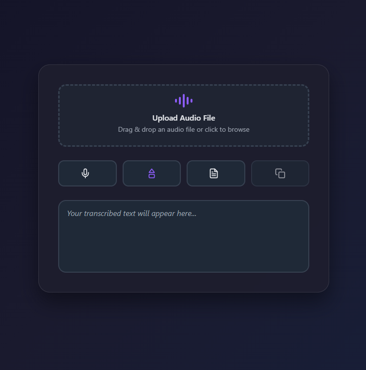

OpenAI API compatible STT model hosted on localhost:5001

### Features 
- Nice GUI
- Microphone recording
- Audio Drag & Drop
- Lazy loading / Auto Unload (5m)

### How To Run
- clone the repo
- run `python server.py`
- go to `http://localhost:5001`

### Using in Open WebUI
- `Admin Panel > Settings > Audio`
- `STT engine: OpenAI`
- `API Base URL: http://localhost:5001/v1`
- `API Key: unused (0)`
- `STT Model: unused (parakeet-v2)`
- Save